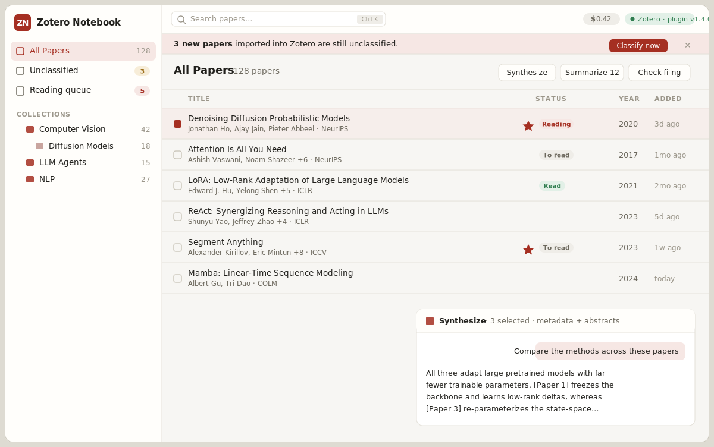

# Zotero Notebook

A desktop companion for [Zotero](https://www.zotero.org/) that mirrors your
library, layers AI on top of it — summaries, multi-paper synthesis, chat,
citation lookup — and keeps your collections tidy by auto-classifying papers
and moving the Zotero collection **and** the PDF on disk together,
transactionally.



> _UI preview (mockup). The real app looks like this once Zotero is connected._

```
┌───────────────────────────────┐        ┌──────────────────────────────┐
│  Zotero Notebook (Tauri 2)    │  HTTP  │  Zotero 7–9 (running)        │
│                               │ 23119  │                              │
│  React UI  ·  Rust core       │◄──────►│  companion plugin (.xpi)     │
│  AI: Gemini / Claude / local  │        │   /zotero-notebook/ping      │
│  SQLite sidecar (app state)   │        │   /zotero-notebook/library   │
│  OS keychain (API keys)       │        │   /zotero-notebook/move-item │
└───────────────────────────────┘        └──────────────────────────────┘
```

Zotero stays the single source of truth — the app never keeps its own copy
of your library. Writes (creating collections, moving items, moving files)
run **inside Zotero** through the bundled companion plugin, with rollback on
failure. The only thing the app owns is a small local sidecar (AI summaries,
reading state, cached citation graphs, and a usage ledger).

## Features

### Your library, mirrored

- **Live mirror of your Zotero collections** — the full nested tree, with
  item counts, straight from the running Zotero instance.
- **Zotero metadata for every PDF** — authors, venue, year, DOI, tags,
  abstract, collections, and the resolved file path on disk.
- **Fast search** — `Ctrl/Cmd+K` fuzzy search across titles, authors, tags,
  venues, abstracts, **and your stored AI summaries**.

### AI that reads your papers

- **AI summaries with Gemini, Claude, *or* a local LLM** — one click in the
  paper popup; stored locally in SQLite and keyed to the Zotero item. The
  default summary uses metadata + abstract (cheap); a separate **Full-text
  summary** button reads the whole PDF (via Zotero's extracted text) for a
  deeper summary. Models are configurable (defaults: `gemini-2.5-pro`,
  `claude-opus-4-8`); cloud keys live in the OS keychain. The local provider
  talks to any OpenAI-compatible server (Ollama, LM Studio, llama.cpp) — see
  [Using a local LLM](#using-a-local-llm-no-cloud-no-api-key).
- **Ask AI about a paper** — a chat tab in the paper popup, grounded in the
  PDF's extracted full text, with streaming answers (always in English).
- **Synthesize across papers** 🆕 — a **Synthesize** button on any collection
  (or an ad-hoc selection) runs multi-paper Q&A: a collection overview, a
  method comparison, or a free-form question (*"which of these use
  diffusion?"*). Grounded in each paper's metadata + abstract (no PDF upload),
  streamed, always in English. Tick rows in the list to scope it to a subset;
  capped at 50 papers per request. See [Synthesis](#synthesis-across-papers).
- **Batch summarize** — a **Summarize N** button quick-summarizes every paper
  in the current view that has no summary yet (confirm first, per-paper
  progress and failure reporting).

### Stay organized

- **Review-then-apply AI classification** — for everything in *Unclassified*:
  the AI proposes a collection per paper (preferring your existing
  collections, proposing a new one only when nothing fits), you edit/approve
  in a review table, then the app applies the moves with per-paper progress.
  Each move updates the Zotero collection **and** relocates the linked PDF to
  the matching folder, atomically with rollback.
- **New-import detection** 🆕 — when papers you import into Zotero land in
  *Unclassified*, a dismissible banner offers to classify them (the app diffs
  the library on refresh / when you return to the window). It only routes you
  into the review flow — nothing is filed without your approval.
- **Filing check for classified papers** — the **Check filing** button asks
  the AI to re-examine each paper's current collection. It is deliberately
  conservative: a paper is flagged only when *no* current collection fits, and
  you review every proposed move (current → suggested, with rationale) before
  anything changes.
- **Reading queue & status** 🆕 — mark any paper *To read* / *Reading* /
  *Read*, flag priorities with a ⭐ star, and jot a private note, all in the
  paper popup. A status column appears in every list and a dedicated **Reading
  queue** view collects what's still unread (starred first). Stored locally —
  never written back to Zotero. See [Reading queue](#reading-queue).

### Discover & connect

- **References & citations** 🆕 — a **References** tab in the paper popup pulls
  the paper's bibliography and citing works from OpenAlex (needs a DOI), marks
  which are already in your library (click to open) versus missing, and
  surfaces the high-impact **seminal works you're missing**. Read-only —
  nothing is written to Zotero; results are cached locally. See
  [References & citations](#references--citations).

### Write value back to Zotero

- **Zotero write-back** — value flows back into your library: fetched
  abstracts fill empty Zotero abstract fields, classification suggests 2–4
  tags (existing vocabulary preferred) that you approve per paper, and AI
  summaries can be mirrored as Zotero child notes (updated in place) — so the
  summaries are visible in Zotero even without this app. Everything is
  additive; existing data is never overwritten. Toggles in Settings.

### Know what you're spending

- **Token & cost tracking** 🆕 — a running cost estimate in the top bar tallies
  the tokens spent on summaries, classification, and filing checks, priced
  from an approximate per-model table (cloud only; the local LLM is free).
  Hover for the token breakdown. See [Cost tracking](#cost-tracking).

### Everywhere

- **Windows installer** (plus Linux `.deb`/`.AppImage` and macOS `.dmg`) from CI.

## Install

1. Download from [Releases](../../releases): the installer for your platform
   **and** `zotero-notebook.xpi`. (If the page is empty, the latest build is
   still a draft — open it and expand *Assets*.)
2. Install the plugin in **Zotero** (7, 8, or 9): Tools → Plugins → gear icon →
   *Install Plugin From File…* → pick the `.xpi` → restart Zotero.
   You can also export the `.xpi` later from the app: *Settings → Zotero →
   Save plugin file*.
3. Run Zotero Notebook. The onboarding checks that Zotero is running and the
   plugin is detected. Without the plugin the app works in read-only mode.
4. *(Optional, enables AI features)* Add an API key in Settings —
   [Gemini](https://aistudio.google.com/apikey) or
   [Anthropic](https://console.anthropic.com/) — **or** run everything locally
   with no key at all: see
   [Using a local LLM](#using-a-local-llm-no-cloud-no-api-key).
5. *(Optional, enables file moves)* Set **Settings → Files** to your linked
   PDF root folder — typically your ZotMoov destination. Leave it empty to
   move only Zotero collections and never touch files.

## Using a local LLM (no cloud, no API key)

Every AI feature — summaries, full-text summaries, Ask AI chat, multi-paper
synthesis, classification, and the filing check — can run entirely on your
machine through any **OpenAI-compatible** server. Your papers never leave your
computer and there is nothing to pay per request.

### Recommended: Ollama

1. **Install [Ollama](https://ollama.com/download)** (Windows installer; or
   `winget install Ollama.Ollama`). After installation Ollama runs as a
   background service on `http://127.0.0.1:11434`.
2. **Download a model** in a terminal:

   ```bash
   ollama pull llama3.1:8b      # good starting point, ~5 GB
   ```

   Larger models give noticeably better classification/chat quality if your
   GPU/RAM allows (e.g. `qwen2.5:14b`, `llama3.1:70b`).
3. In Zotero Notebook open **Settings → AI Provider**, select **Local LLM**,
   and check the fields (defaults match Ollama):
   - *Server URL*: `http://127.0.0.1:11434/v1`
   - *Model*: `llama3.1:8b` (whatever you pulled)
4. **Save changes**, then press **Test** — you should see "Works".

### Alternative: LM Studio (GUI)

1. Install [LM Studio](https://lmstudio.ai/), download a model from its
   built-in browser, and start the **local server** (Developer tab).
2. In Settings → Local LLM set the URL to `http://127.0.0.1:1234/v1` and the
   model to the name LM Studio shows. Any other OpenAI-compatible server
   (llama.cpp `llama-server`, vLLM, …) works the same way — point the URL at
   it.

### Notes on local models

- No API key is needed (a stored key is sent as a Bearer token for servers
  that require one).
- Small local models are weaker than Gemini/Claude at producing the strict
  JSON the classification and filing-check features need. The app embeds the
  JSON schema in the prompt, requests structured output when the server
  supports it, and tolerates markdown-wrapped answers — but with 7–8B models
  expect the occasional skipped paper. Chat, summaries, and synthesis work
  well even on small models.
- Local inference is slower than the cloud APIs (the app allows up to 10
  minutes per request).
- The local provider is **free**, so the cost estimate stays at $0 for it.

### Works with your existing ZotMoov setup

ZotMoov keeps handling newly imported attachments exactly as before. When you
approve a classification, Zotero Notebook performs its own collection+file
move through the companion plugin (inside Zotero, transactional, rolled back
on failure) — files end up in `<file root>/<Collection>/<Sub-collection>/`,
consistent with a collection-named folder pattern. Keep your ZotMoov folder
pattern aligned with collection names so both tools agree.

## How classification works

1. Open **Unclassified** (papers in the *Unclassified* collection or in no
   collection at all) and press **Classify with AI**.
2. The LLM sees each paper's metadata plus your existing collection paths. It
   must prefer an existing collection and may propose a new one (max 3 levels)
   only when nothing fits. Proposals are normalized against the real tree —
   casing is canonicalized and "is this new?" is recomputed, so `llm` can
   never be created next to an existing `LLM`.
3. Nothing moves until you approve. In the review table you can untick rows,
   change targets, or type a brand-new path.
4. Apply: per paper, the plugin creates missing collections, updates
   memberships (removing only the *Unclassified* membership), and moves the
   linked PDF. Failures roll back and the paper stays in *Unclassified*.

## Synthesis across papers

The **Synthesize** button (in any collection header) opens a chat scoped to a
whole collection — or to an ad-hoc subset you tick in the list. It is built
for the questions you can't answer one paper at a time:

- **Overview** — *"Give me a structured overview of these papers…"*
- **Compare** — *"Compare the methods and approaches across these papers."*
- **Library-wide Q&A** — *"Which of these use diffusion?"*

Context is **metadata + abstracts only** (no PDF text is uploaded), so it
scales cheaply to a whole collection. Answers cite papers as `[Paper N]`,
stream live, and are always in English. The request is capped at 50 papers (it
tells you when it used the first 50 of a larger set).

## Reading queue

Open any paper and set its **Reading status** (*To read* / *Reading* /
*Read*), toggle a **⭐ priority** star, and add a private note. From then on:

- a compact status badge shows in every list (sortable column);
- the sidebar **Reading queue** gathers everything still *To read* or
  *Reading* across all collections, starred items first;
- you can still run Summarize / Synthesize / Check filing over the queue.

All of this lives only in the app's local sidecar DB, keyed by Zotero item
key — nothing is written back to Zotero.

## References & citations

The **References** tab (in the paper popup, when the item has a DOI) fetches
the paper's bibliography and the works that cite it from
[OpenAlex](https://openalex.org/) and tags each against your library:

- **In library** — already in your collection (click to jump to it);
- **Missing** — not in your library, with a link to its DOI;
- **Seminal works you're missing** — the highest-cited references you don't
  yet have, surfaced at the top.

It is strictly read-only / suggest-only — nothing is added to Zotero. Results
are cached locally (14-day TTL); a **Refresh** button re-fetches.

## Cost tracking

The top-bar pill shows the cumulative estimated cost of the AI work the app
has done — summaries, classification, and filing checks. Token counts come
from the providers' own responses; the dollar figure is an **approximate**
list-price estimate per model (see `core/src/pricing.rs`). The local provider
is free, so it never adds to the total. (Interactive chat is not metered yet.)

## Development

Prerequisites: Rust (stable), Node 22+. The core logic is a headless crate,
fully testable without Zotero or any GUI libraries:

```bash
cargo test -p zn-core      # Zotero/LLM/citation clients vs mock servers + unit tests

cd app
npm install
npm test                   # frontend component tests (vitest)
npx tsc --noEmit           # type check
npm run build:plugin       # package zotero-plugin/ into the bundled .xpi
npm run tauri dev          # run the desktop app (needs WebKitGTK on Linux)
npm run tauri build        # produce installers locally
```

| Path | What it is |
|---|---|
| `core/` | Headless Rust crate: Zotero clients, Gemini/Anthropic/local clients, classification, synthesis, citations, pricing, SQLite sidecar, settings, keychain |
| `app/src/` | React + TypeScript + Tailwind UI |
| `app/src-tauri/` | Thin Tauri 2 shell (commands, watcher, bundling) |
| `zotero-plugin/` | The companion Zotero plugin (bootstrap.js) |
| `docs/ARCHITECTURE.md` | Design + Tauri command table |
| `docs/PLUGIN_API.md` | Plugin wire format (single source of truth) |

## Limitations

- Zotero must be running; the app talks to it on `127.0.0.1:23119`.
- Moves and classification require the companion plugin (read-only mode
  without it).
- Summaries and synthesis are metadata/abstract-based by default — when a
  paper has no abstract in Zotero, the app fetches one from Crossref →
  Semantic Scholar → OpenAlex (free, no key); if none is found, the summary is
  generated from the title/venue alone and flagged with a "No abstract" badge.
- References & citations need a DOI on the item and an OpenAlex match.
- Cost figures are approximate estimates, not billing; interactive chat is not
  yet counted.
- User library only; group libraries are not supported yet.
